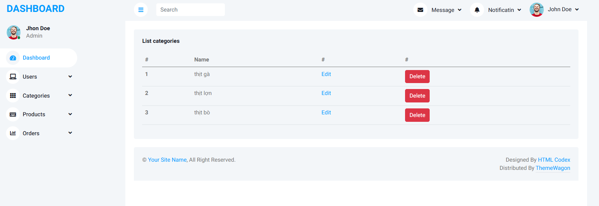
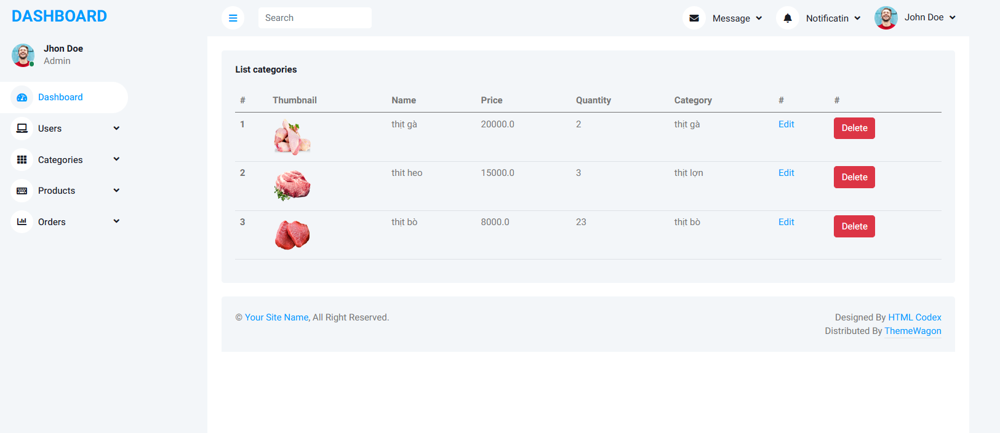

#### Hoàng Đình Hiến
 ### HTML & CSS - Thiết kế website 
 # Giới thiệu
 - Trang web Bemet chính là một website bán hàng với sản phẩm chủ yếu là Thực Phẩm.
 - Trang web được xây dưng dựa trên 3 thành phần chính: Frontend, Backend, Database.
 # Các thành phần chính:
  - Backend: Sử dụng Java Servlet và JSP để xử lý logic, tạo API và xử lý giao diện người dùng.
  - Frontend: Dùng HTML, CSS, và JavaScript để xây dựng giao diện.
  - Database: MySQL hoặc SQL Server để lưu trữ thông tin sản phẩm, đơn hàng, và khách hàng.
### Dưới đây là những hình ảnh chi tiết về website này:
# Trang Home

# Trang About

# Trang Products

# Trang Detail Product và sản phẩm liên quan

# Trang Cart

# Trang Login

# Trang Register

# Trang Admin

